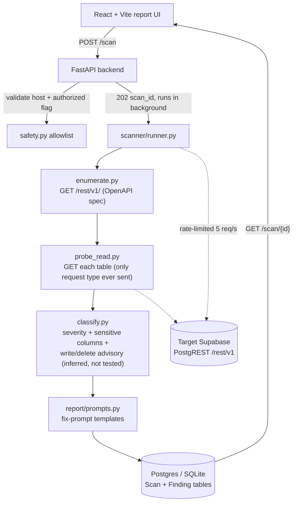

# RLS-Sentinel

**The business problem:** Supabase makes it trivial to ship a backend in an afternoon — and just as trivial to forget to enable Row Level Security on a table, silently leaving it readable, writable, or deletable by anyone on the internet holding the public anon key. RLS-Sentinel scans a Supabase project the way an attacker would, without touching a single row of real data, and hands back a report with the exact SQL to fix each hole.

## What it does

Given a Supabase project URL and its public anon key, RLS-Sentinel:

1. Enumerates every table exposed via PostgREST (or uses table names supplied directly, if the target blocks anon-key schema discovery — see below).
2. Probes each table as an anonymous, unauthenticated visitor would — **read only**, via `GET`.
3. Classifies what it finds into severities (critical → info). Write/delete risk is reported as an advisory inferred from read exposure, never by attempting a real write.
4. Renders a report where every finding ships with a paste-ready fix prompt for Cursor, Lovable, or the Supabase SQL editor.

It never needs your database password, never runs as a superuser, and never modifies your data. See **Safety Design** below — this is the whole point of the tool.

## Safety Design (read this first)

This is a security tool. If it isn't trustworthy on this axis, nothing else about it matters.

- **The scanner never sends a mutating request.** No POST, PATCH, or DELETE is ever issued against the target — every probe is a `GET`. This was not the original design: an earlier version dry-ran writes inside `Prefer: tx=rollback`, PostgREST's documented rollback-on-commit mechanism. Testing against a real Supabase project proved that current-generation Supabase does not honor that preference — a "dry-run" DELETE permanently deleted a real row. Since a transactional safety net can't be trusted, the only way to make "never touches your data" true is to never send the request that could touch it. Write/delete risk is instead **inferred**: if a table's rows are visible to anon (proven via a safe `GET`), its default write/delete grants are flagged as worth a manual check — this is a labeled, less-certain advisory, never a claimed verification.
- **Host allowlist.** Only `*.supabase.co` / `*.supabase.in` HTTPS hosts are accepted. The validator is a full-string-anchored regex on the hostname — tricks like `evil-supabase.co`, `supabase.co.attacker.com`, or userinfo (`user:pass@host`) are rejected before any request is made. See `backend/app/scanner/safety.py`.
- **Explicit authorization gate.** The API refuses to run without `"authorized": true` in the request body (enforced at the type level — the field is `Literal[True]`, so `false` is a validation error, not a runtime branch that could be skipped).
- **Rate limited.** A shared async limiter caps probing at 5 req/s by default (configurable), independent of the per-endpoint `10/minute` limit on scan creation.
- **No secrets in logs.** The anon key is held in memory for the life of a scan and never written to the database or logs. A redacting log formatter additionally scrubs anything that looks like a key/token as defense-in-depth.

## Architecture



## Tech stack

- **Backend:** Python 3.11, FastAPI, httpx (async), Pydantic v2, SQLModel, slowapi
- **Frontend:** React + Vite + TypeScript + Tailwind CSS v4, React Router
- **Storage:** SQLite for local dev (zero setup), Postgres via docker-compose for a production-shaped run

## Project layout

```
rls-sentinel/
  backend/
    app/
      main.py            # FastAPI entry: POST /scan, GET /scan/{id}, GET /scan/{id}/report.json
      scanner/
        enumerate.py     # table discovery via PostgREST's OpenAPI doc (falls back to caller-supplied table_names)
        probe_read.py    # GET probes — the only request type ever sent to the target
        classify.py      # severity logic + write/delete advisory (inferred from read, never live-tested)
        safety.py        # host allowlist, rate limiter
        runner.py         # orchestrator, invoked as a FastAPI BackgroundTask
      models.py          # Scan, Finding (SQLModel)
      report/prompts.py  # fix-prompt templates
      config.py, db.py, logging_config.py
    tests/                # pytest: classify + safety + API contract (28 tests)
  frontend/
    src/
      components/ScanForm.tsx, FindingCard.tsx
      pages/Report.tsx
      lib/api.ts
  docker-compose.yml
```

## Setup

**Prerequisites:** Python 3.11+, Node 18+. Docker optional (only needed for the Postgres-backed compose run).

### Local run (SQLite, fastest path)

```bash
cd rls-sentinel/backend
python3 -m venv .venv && source .venv/bin/activate
pip install -r requirements.txt
cp .env.example .env
uvicorn app.main:app --reload --port 8000
```

```bash
# in a second terminal
cd rls-sentinel/frontend
npm install
npm run dev
```

Open http://localhost:5173. The Vite dev server proxies `/api/*` to `http://localhost:8000`.

### Docker Compose (Postgres-backed)

```bash
cd rls-sentinel
docker compose up --build
```

- Frontend: http://localhost:8080
- Backend: http://localhost:8000
- Postgres: localhost:5432 (user/pass `rls`/`rls`, db `rls_sentinel`)

### Running tests

```bash
cd rls-sentinel/backend
source .venv/bin/activate
pytest -v
```

28 tests covering `classify.py`'s severity matrix, sensitive-column detection, and the write/delete advisory logic; the host-allowlist safety filter (9 rejection cases + 3 acceptance cases); the rate limiter; and the API contract (auth gate, host validation, 404s, happy path).

## Using it

1. Get a Supabase project's URL and **anon/public** key (never `service_role`) from Project Settings → API.
2. Open the app, paste them in, check "I own this project or have permission to scan it," and run.
3. Read the report. Each card shows the table, severity, a plain-English "an attacker could ___" sentence, and a **Copy** button with the exact SQL to paste into the Supabase SQL editor, Cursor, or Lovable to fix it.

## API contract

```
POST /scan
  { "target_url": "https://<ref>.supabase.co", "anon_key": "...", "authorized": true,
    "table_names": ["customers", "orders"]   // optional — required if the target
                                              // blocks anon-key schema discovery
  }
  -> 202 { "scan_id": "..." }

GET /scan/{id}
  -> { "status": "pending|running|complete|failed", "findings": [...], ... }

GET /scan/{id}/report.json
  -> full structured report
```

## Demo


*Demo GIF: run against a seeded throwaway Supabase project, showing a critical read finding and the paste-ready fix.*

## Live demo

_placeholder — deploy target TBD (Railway/Render for the backend, Vercel for the frontend)._
